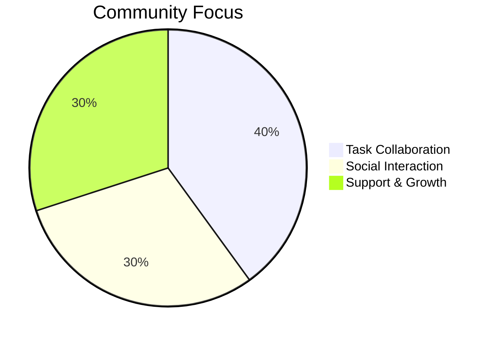
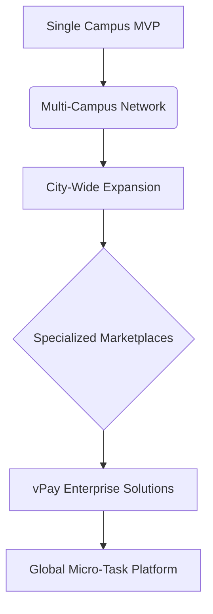

# 🚀 vPay - Campus Task & Payment Platform
>
> **Empowering students,startups,small businesses to collaborate, earn, and grow through micro-tasks**

---

## 🌟 Features Overview

Welcome to the vPay Features Overview! This document outlines the current functionalities, planned Minimum Viable Product (MVP) features, and our exciting roadmap for future development. Our goal is to create a vibrant, efficient, and trustworthy platform for the campus community.

---

## ✅ Implemented Features (Live Now)

These are the core features currently available in vPay:

### 👤 Account Management

- ⚙️ **Settings & Profile**: Manage account details, view achievements, skills, and testimonials.
- 🎨 **Personalization**: Light/dark themes + animated avatar customization.
- 🏆 **Achievement System**: Track progress, unlock achievements with animations, earn XP, level up, and receive notifications.
- 🛠️ **Skills Management**: Display, add, or remove skills.
- 📜 **Testimonials**: View and submit testimonials.

### 🔑 Authentication

- 📧 **Email/Password**: Secure sign-up and sign-in.
- 🔄 **Session Management**: Robust user session handling.
- 🖥️ **Auth UI**: Dedicated Login, Registration, and Password Reset screens.
- 🤳 **Social Logins**: UI for Google & Facebook (backend integration pending).
- 🔒 **Biometric Auth**: Fingerprint/Face ID login via `local_auth`.

### 🏠 Home/Dashboard

- 📊 **Overview**: Main screen with task summaries and quick actions.

### 📝 Task Management

- 🏷️ **Task Model**: Comprehensive attributes (ID, title, description, creator/assignee, amount, currency, dates, status, category, location, tags).
- 🗂️ **Task Statuses**: Pending, InProgress, Completed, Cancelled.
- 📚 **Task Categories**: Academic Support, Campus Errands, Tech Help, Event Support, Other.
- 🔄 **Task Repository**: Stream all tasks, user-specific tasks; create, update, delete tasks with validation, transactions, and real-time updates.
- 🔍 **Full-Text Search**: Efficiently find tasks.
- ⚙️ **State Management**: `tasksProvider` for lists, loading, errors, filters.
- 📱 **Task UI**: Screens for Listing (with TaskCard, refresh, filter), Creation (with validation), Details, and User's Tasks.

### ⭐ Ratings & Reviews

- 🌟 **Display**: View task ratings and reviews.
- ✍️ **Submission**: Rate users and provide reviews post-task.

### 💳 Payments (Basic UPI)

- 📄 **Payment Model**: Tracks ID, task ID, payer/payee, amount, status, transaction ID, timestamps.
- 📲 **UPI Integration**: Fetch UPI apps and initiate transactions via `upi_india` (placeholder UPI ID).
- ⚙️ **State Management**: `paymentProvider` for UPI app loading, payment initiation, and state tracking.
- 💻 **Payment UI**: Screen to display amount, list UPI apps, and start payment.

### 💬 Chat & Communication

- ✉️ **Chat Model**: Message ID, task ID, sender/receiver, content, timestamp, read status.
- 📤 **Chat Repository**: Send messages, stream messages per task, mark as read.
- ⚙️ **State Management**: `chatProvider` for message streams.
- 📱 **Chat UI**: `chat_screen.dart` with message bubbles, input field; `chat_list_item.dart` for summaries.
- 🔗 **Task Integration**: Chat rooms automatically created upon task assignment.

### 🔔 Notifications

- 📢 **Notification Model**: ID, user ID, title, message, type (TaskCreated, TaskAssigned, etc.), task ID, read status.
- 📡 **Notification Repository**: Stream user notifications, mark as read.
- 🔥 **Push & Local**: Firebase Messaging (background/foreground) and `flutter_local_notifications`.
- ⚙️ **State Management**: `notificationProvider` for notification lists.
- 📱 **Notification UI**: `notification_screen.dart` with `NotificationTile`.

### 🧑‍💼 User Profiles

- ℹ️ **User Model**: ID, email, full name, avatar URL, phone, verification status.
- 🔄 **Profile Data**: Fetched/updated via AuthRepository (Supabase 'profiles' table).
- 📈 **Profile UI**: Displays stats, skills, and reviews.

### 🗺️ Location Services (Basic)

- 📍 **Map Display**: Uses `google_maps_flutter`.
- 🌍 **Location Fetching**: Basic functionality with `geolocator` and `geocoding`.

### 🗓️ Worker Availability (Basic)

- 📅 **Status Toggle**: Simple on/off for workers to indicate general unavailability.

---

## 🚧 Planned MVP Features

The following table outlines features targeted for the full MVP, building upon the implemented base.

| Feature Area                      | Status        | Key Components                                                                 |
| --------------------------------- | ------------- | ------------------------------------------------------------------------------ |
| 👤 User Authentication & Profiles | ✅ Complete   | Email/Password, basic profile.                                                 |
| 📝 Core Task Posting & Discovery  | ✅ Complete   | Posting, discovery with location-aware filtering.                              |
| 💳 Integrated Digital Payments    | 🚧 Partially  | Basic UPI functional. **MVP Target**: In-app balance/wallet, Escrow, Stripe.   |
| 🛡️ Fundamental Trust & Reporting  | 🚧 Partially  | Basic ratings. **MVP Target**: Basic user reporting interface.                   |
| 💬 In-App Communication           | ✅ Complete   | Text messaging for active tasks.                                               |
| 🔄 Basic Task Workflow            | ✅ Complete   | Accept, complete, approve/reject tasks.                                        |
| ✓ Basic Verification              | ✅ Complete   | Confirmed email. Phone verification enhancement planned.                       |

---

## 🔮 Future Roadmap (Post-MVP)

Our vision extends far beyond the MVP. Here’s a glimpse into planned enhancements:

### 💳 Payment Innovations

```mermaid
graph LR
    A[Basic UPI] --> B(Full In-App Wallet);
    B --> C{Escrow System};
    C --> D[Multiple Gateways (Stripe, Razorpay)];
    D --> E[Automated Worker Payouts];
    E --> F[Tipping Functionality];
```

- 💸 **Full In-app Wallet & Escrow**: Secure multi-stage payments.
- 🔗 **Multiple Payment Gateways**: Stripe, Razorpay for wider options.
- 🏧 **Automated Payouts**: Seamless fund transfers to worker accounts.
- 👍 **Tipping**: Allow users to add tips for exceptional service.

### 📈 Task Ecosystem Expansion

- 📅 **Advanced Scheduling**: Recurring tasks, calendar sync.
- 🛍️ **Task Bundles**: Group related tasks for single posting.
- 🛠️ **Advanced Task Templates**: Pre-fill common task details.
- 🔔 **Enhanced Notification Preferences**: Granular control over alerts.
- 🔍 **Improved Search Filters**: More powerful and intuitive task searching.
- 📝 **Multi-stage Tasks**: Sub-task tracking and completion.
- 💰 **"Bid for Task" Option**: Users propose rates for tasks.
- 📱 **Offline Access**: View critical task details without internet.
- 📊 **Personalized User Dashboard**: Relevant suggestions and summaries.
- 🛠️ **Integrated Upskilling Pathways**: Micro-credentials and learning resources.
- 📈 **Detailed User Analytics Dashboards**: For users to track their activity.

### 🛡 Enhanced Trust & Safety

- 🆔 **Student ID Verification**: Enhanced verification for campus users.
- 📄 **Advanced User Verification**: Document scans, (optional) biometrics for sensitive tasks.
- ⚖️ **Robust Dispute Resolution**: Fair and transparent conflict handling.
- 🌟 **Multidimensional Trust Metrics**: Skill credibility, reliability indices.
- 🔗 **Cross-Platform Reputation Portability**: Explore decentralized identifiers.
- 📍 **Verified Locations for Tasks**: Ensure task locations are known and safe.
- 🛡️ **Task Insurance Options**: Optional insurance for high-value tasks.
- 🤫 **Anonymous Reporting**: For sensitive issues and feedback.
- 🔐 **Two-Factor Authentication (2FA)**: For high-value transactions or security changes.
- 🆘 **Emergency Contact Feature**: Quickly notify a trusted contact.
- 📍 **Privacy-Preserving Location Tracking**: Secure methods for location verification.

### 🌐 Community Building



- 🤝 **User Groups/Clubs**: For collaborative tasks or interests.
- 🎉 **Gamification Elements**: Streaks, points for task completion.
- 📰 **Public Task Feeds**: Filterable by category or location.
- 🏅 **User Kudos/Badges**: Recognize helpfulness and skills.
- 🏢 **Group/Department Task Boards**: Focused task areas.
- 🌟 **Community Ratings & Leaderboards**: Foster healthy competition.
- 👨‍👩‍👧‍👦 **Task Teams**: For collaborative work on larger projects.
- 🗣️ **Integrated Community Forums**: Support and discussion spaces.
- 💬 **Advanced Messaging**: Group chats, file sharing, read receipts.
- 🎁 **Daily Login Rewards/Streaks**: Encourage consistent app usage.

### ✨ General Convenience & Productivity Features

- 📅 **Smart Reminders & To-Do Lists (Integrated):** Allow users to convert tasks into personal to-do list items or get smart reminders.
- 📋 **Batch Task Actions:** Ability to select multiple tasks and perform actions like archive, delete, or mark as complete.
- ⚡ **Quick Apply/Templates for Task Posting:** Users can save common task details as templates for faster posting.

### 🔍 Discovery & Recommendation Enhancements

- 💡 **"You Might Be Interested In" Task Section:** Suggest relevant tasks based on user's skills, past activity, or profile.
- 💾 **Saved Searches & Alerts for New Tasks:** Users can save search criteria and get notified for matching new tasks.
- 🌟 **Worker Showcase/Portfolio Enhancements:** Improved ways for taskers to showcase completed work and skills.

### 💸 Financial Management & Insights (User-Centric)

- 📈 **Personal Earnings/Spending Tracker:** Simple in-app tools for users to see their vPay financial activity.
- 🎯 **Goal Setting for Earnings:** Allow users to set financial goals and track progress.
- 🧾 **Simplified Expense Reporting for Tasks:** Tools to easily log expenses related to tasks for reimbursement or records.

### 🧠 Contextual & Smart Features

- 📍 **Location-Aware Task Suggestions (Proactive):** Suggest tasks nearby when a user enters a specific campus area.
- ⏳ **Time-Based Availability Status:** Users can set their availability for specific times (e.g., "Available after 3 PM").
- 📬 **Automated Summary/Digest Notifications:** Daily or weekly summaries of relevant tasks or platform activity.

### 🤖 AI & Automation

- 🧠 **AI Skill-Based Matching**: Intelligent algorithm for task assignment.
- 🎯 **AI Predictive Allocation**: Suggest tasks based on user patterns (with transparency).
- 📅 **Automated Scheduling Suggestions**: AI assistance for planning.
- ✨ **AI Personalized Task Recommendations**: Based on user behavior and skills.
- 💬 **AI Content Moderation**: Flag inappropriate content in descriptions/chat.
- 🔗 **Zapier/IFTTT Integrations**: Connect vPay with other apps for automated workflows.
- 🔄 **API Access for 3rd Parties**: Allow other services to integrate.
- 📅 **External Calendar Integration**: Sync tasks with Google Calendar, Outlook, etc.

### ♿ Accessibility Focus

- 🗣️ **Voice Command Integration**: Hands-free app operation.
- 👁️ **Comprehensive Voice Navigation & Screen Reader Support**: For visually impaired users.
- 📱 **Customizable UI Elements**: Font sizes, color contrast themes for diverse needs.

### 📊 Monetization

| Feature                               | Description                                          | Target User    |
| ------------------------------------- | ---------------------------------------------------- | -------------- |
| 🚀 **Promote Your Task**              | Paid feature for increased task visibility.          | Task Posters   |
| 🤝 **Affiliate Program**              | Rewards for user referrals and new user acquisition. | All Users      |
| 🏢 **Business Accounts**              | Specialized features for campus organizations.       | Businesses     |
| 묶 **Bulk Task Posting**              | Efficiently post multiple tasks at once.             | Businesses     |
| ✅ **Verified Business Status**       | Branding and trust for business accounts.            | Businesses     |
| 📦 **Subscription Packages**          | For enterprise users with recurring needs.           | Businesses     |
| 🎯 **Recruitment & Talent Sourcing**  | Connect businesses with skilled student workers.     | Businesses     |
| ✨ **Premium Features**               | Badges, urgent task highlighting, etc.               | Power Users    |
| 📈 **Data Insights (Anonymized)**     | Aggregated, consented data for trends.               | Platform/Admin |
| 🏷️ **White-Labeling Solutions**        | Offer vPay platform to other organizations.          | Institutions   |
| 📊 **Enhanced Admin Analytics**       | Dashboards for campus administrators.                | Admin          |

---

## 🔭 Long-Term Vision

Our ultimate goal is to create a self-sustaining ecosystem that expands beyond a single campus.



- 🚀 **Multi-Campus Networks**: Connecting students across universities.
- 🏙️ **Neighborhood/City-Wide Expansion**: Bringing vPay to the broader community.
- 🎓 **Integrated Upskilling & Credentials**: Formalizing skills gained on the platform.
- 🔗 **Decentralized Identity & Reputation**: Portable trust across platforms.

---
> **“Building the future of trust and skill sharing – one task at a time”**
> *vPay Development Team*
---
