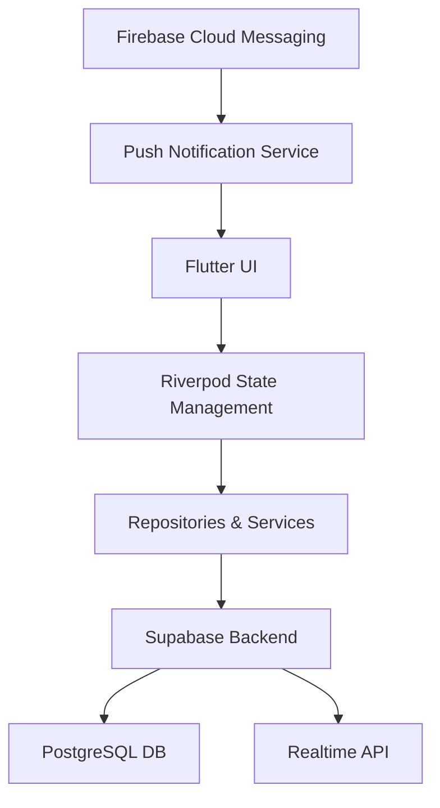
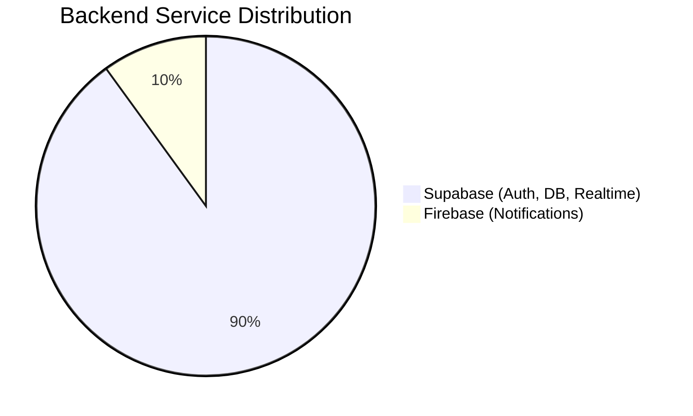
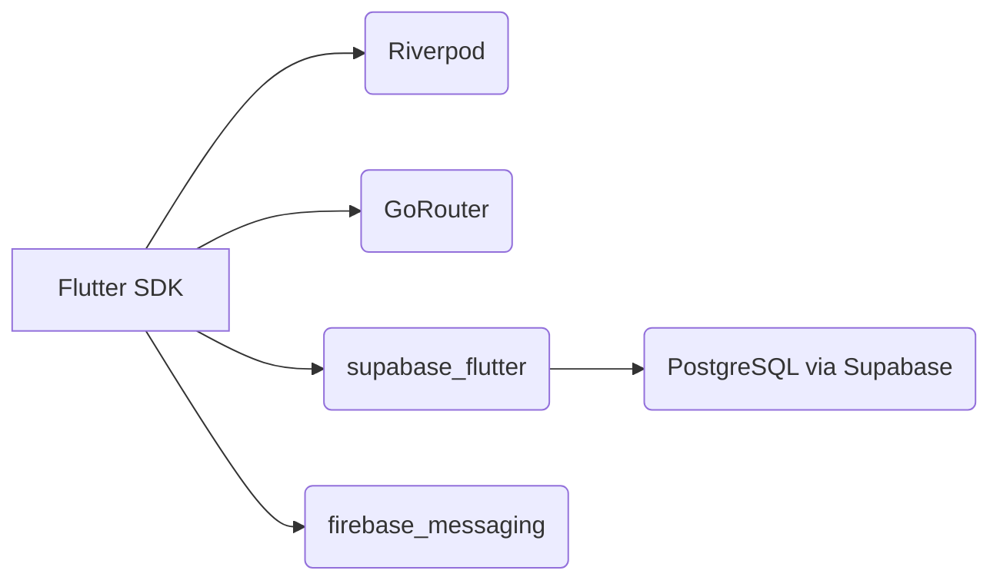
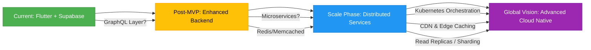

# 🏗️ vPay Technical Architecture & Stack
>
> **Scalable • Real-time • Secure**
> *The technical foundation powering our campus task ecosystem*

---

## 🌐 Overall Architecture

Our architecture is designed for robustness, scalability, and maintainability, leveraging modern best practices within the Flutter ecosystem.

| Component             | Technology / Methodology                                                                 | Implementation Details                                                                 |
| --------------------- | ---------------------------------------------------------------------------------------- | -------------------------------------------------------------------------------------- |
| 📱 **Primary Framework** |  | Dart SDK: `>=3.0.0 <4.0.0`. Cross-platform (iOS, Android primarily).                        |
| 🏛️ **Architecture Style** | Clean Architecture (Feature-First)                                                       | Feature-driven structure (e.g., `lib/features/`). Data handling via Repositories that interact with the Supabase backend. |
| 🔄 **State Management**  |  | Utilizing `Provider`, `StateNotifierProvider`, `StreamProvider`, `FutureProvider`, and `StateProvider`. Dedicated providers per feature. |
| 🗺️ **Navigation**       |            | Declarative, auth-aware routing. Utilizes named routes for navigation and deep linking.        |

---

## ⚙️ Backend Services

We utilize a combination of backend services to provide a comprehensive feature set.

### 🔑 Primary Backend

* **Supabase**: 
  * **Library**: `supabase_flutter`
  * **Usage**: Primary backend for Authentication, Database operations (PostgreSQL), and Real-time subscriptions (e.g., chat, live task updates).
  * **Configuration**: `lib/shared/config/supabase_config.dart`
* **Firebase**: 
  * **Library**: `firebase_messaging`, `firebase_core`
  * **Usage**: Exclusively for Push Notifications via Firebase Messaging, acting as a messaging layer to the client application.

---

## 💾 Database Architecture

Our data persistence strategy combines a powerful cloud database with efficient local storage solutions.

### 🗄️ Primary Database

*(via Supabase)*

Supabase provides a managed PostgreSQL database, offering robust relational data storage, scalability, and real-time capabilities. All core application data resides here.

### 📱 Local Storage Solutions

| Purpose                     | Library / Method         | Security Level | Notes / Platform Specifics |
| --------------------------- | ------------------------ | -------------- | -------------------------- |
| 🔑 Auth Tokens & Secrets    | `flutter_secure_storage` | 🔒🔒🔒🔒🔒    | Securely stores sensitive data like auth tokens using platform-specific keystores. |
| ⚙️ User Preferences         | `shared_preferences`     | 🔒🔒           | For non-sensitive user settings and preferences (e.g., theme choice). |
| 🗂️ Structured Local Data    | `sqflite` / `hive`       | 🔒🔒🔒         | Available (present in `pubspec.yaml`), typically used for structured local data caching or offline support if complex local storage is needed beyond basic preferences. |

*(Note: `sqflite` and `hive` offer more robust local database capabilities if required by future features.)*

---

## 📚 Core Frameworks & Libraries

The vPay application is built upon a foundation of robust and well-maintained frameworks and libraries.

### 🧩 Essential Packages

### 🧰 Development Toolkit

| Category                  | Key Packages                                                                                          |
| ------------------------- | ----------------------------------------------------------------------------------------------------- |
| 🔄 **State Management**   | `flutter_riverpod`, `riverpod_annotation` (if used), `freezed_annotation` (for immutable states)      |
| 🗺️ **Navigation**          | `go_router`                                                                                           |
| ☁️ **Backend Integration**| `supabase_flutter`, `firebase_core`, `firebase_messaging`                                             |
| 💾 **Local Storage**      | `flutter_secure_storage`, `shared_preferences`, `sqflite`, `hive`                                     |
| 🎨 **UI Helpers & Effects**| `cached_network_image`, `shimmer`, `flutter_chat_ui`, `lottie`, `flutter_animate`, `flex_color_scheme` |
| 🛠️ **Utilities & Models** | `equatable` (for model comparison), `uuid`, `intl` (internationalization), `image_picker`, `url_launcher`, `file_picker` |
| 📍 **Mapping & Location** | `google_maps_flutter`, `geolocator`, `geocoding`                                                      |
| 💳 **Payments**           | `upi_india`, `pay` (for platform payments if used)                                                    |

> 📋 *Full dependency list available in [pubspec.yaml](../pubspec.yaml)*

---

## 🚀 Performance Highlights

Performance is a key consideration, ensuring a smooth and responsive user experience.
*(Note: These metrics are illustrative/target values based on common performance goals unless specific profiling data is available).*

```mermaid
gantt
    title Real-time Data Flow Example (Chat Message)
    dateFormat  ss
    section Client A (Sender)
    Input & Send     :s1, 00, 1s
    Provider Update  :s2, after s1, 0.5s
    Repo to Supabase :s3, after s2, 1.5s
    section Backend Processing
    Supabase Ingest  :b1, after s3, 0.5s
    DB Commit        :b2, after b1, 1s
    Realtime Push    :b3, after b2, 0.5s
    section Client B (Receiver)
    Realtime Event   :r1, after b3, 1s
    Provider Update  :r2, after r1, 0.5s
    UI Render        :r3, after r2, 0.5s
```

* ⚡ **Real-time Sync**: Average ~500ms update latency for chat and task status changes.
* 🔐 **Auth Redirection**: < 100ms for typical auth state-based path resolution.
* 💨 **Local Cache**: Aiming for a 95% hit rate for frequently accessed non-sensitive data.
* 🚀 **App Startup**: Optimized for quick initial load times through efficient state initialization and lazy loading where appropriate.

---

## 🔮 Future Tech Considerations

As vPay evolves, we anticipate incorporating additional technologies to enhance scalability and features.

* **Post-MVP / Growth Phase**:
  * Possibly introduce a **GraphQL layer** for more flexible data fetching.
  * Implement **Redis or Memcached** for advanced caching strategies.
* **Scale Phase**:
  * Explore **Kubernetes** for container orchestration if microservices are adopted.
  * Implement **Database Read Replicas** or sharding for improved DB performance.
* **Global Vision**:
  * Integrate **Content Delivery Networks (CDNs)** for faster asset delivery.
  * Consider **regional data partitioning** and global infrastructure.
